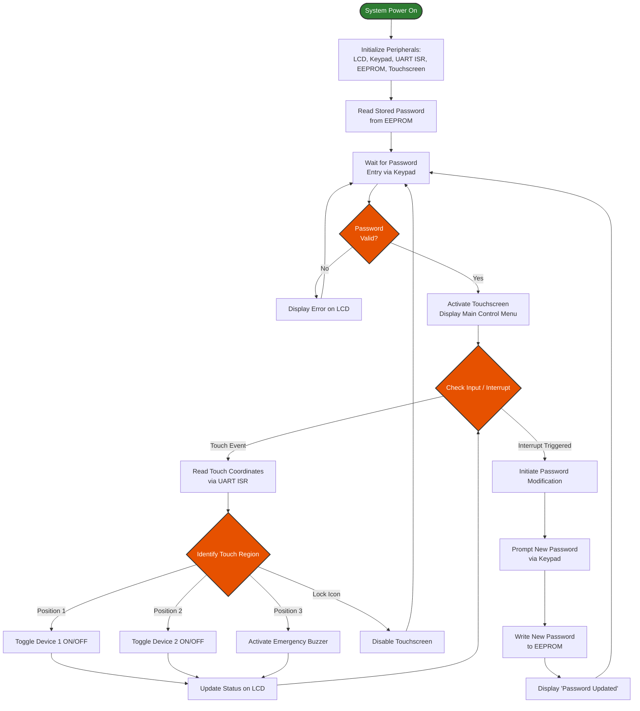

# TOUCH-BASED-DEVICE-CONTROL-SYSTEM-FOR-BEDRIDDEN-PATIENTS

## Overview

This project implements a Password-Protected Touch-Based Device Control System for Bedridden Patients using the LPC2148 ARM7 Microcontroller. The system enables physically challenged or bedridden individuals to control household devices through a resistive touch screen interface after successful password authentication. Passwords are securely stored in EEPROM and can be modified when required. The system also includes an emergency alert feature using a buzzer, providing additional safety and convenience.

---

## Block Diagram


# 🏥 Touch-Based Device Control System for Bedridden Patients

An accessible, secure, and touch-operated device control system built on the **LPC2148 ARM7** microcontroller. Designed specifically for bedridden patients, elderly individuals, and rehabilitation care, this system allows users to control ambient appliances (lights, fans) and trigger emergency alerts independently.

---
## 📁 Project Structure

```text
├── project_main.c
├── delay.c/delay.h
├── types.h
├── defines.h
├── lcd_defines.h
├── lcd.c / lcd.h
├── keypad.c / keypad.h / keypad_defines.h
├── SPI.c / SPI.h / SPI_defines.h
├──interrupt.c / interrupt.h
├── pin_connect_block.c / pin_connect_block.h
├── touch_1.c / touch_1.h
└── uart.c / uart.h
```
## 📌 System Features

* **🔑 Password-Protected Access:** Matrix keypad input with non-volatile password storage in SPI EEPROM.
* **📱 Touch-Screen UI:** UART-driven resistive touch interface for seamless device toggling.
* **⚡ Low-Latency Interrupts:** Fast response times using interrupt-driven UART communication.
* **📺 Real-time Telemetry:** 16x2 LCD display provides visual status updates and security feedback.
* **🚨 Emergency Alert System:** Dedicated touch trigger for immediate buzzer activation.
* **🔒 EEPROM Password Reprogramming:** Securely update and permanently write new credentials on-the-fly.

---

## 🛠️ Hardware & Software Requirements

### Hardware Components
* **Microcontroller:** LPC2148 ARM7TDMI-S
* **Touch Interface:** Resistive Touch Screen Module + Controller
* **Storage:** AT25LC512 SPI EEPROM
* **Input Device:** 4x4 Matrix Keypad
* **Display:** 16x2 Character LCD
* **Actuators/Outputs:** LED1 (Light), LED2 (Fan), Piezo Buzzer
* **Power Supply:** 5V / 3.3V Regulated DC Supply

### Software Toolchain
* **Language:** Embedded C
* **IDE:** Keil µVision (ARM Compiler)
* **Flashing Tool:** Flash Magic
* **Simulation (Optional):** Proteus VSM

---

## 📐 System Architecture

| Peripheral | Protocol / Bus | Description |
| :--- | :--- | :--- |
| **Resistive Touch** | UART (Interrupt Driven) | Sends coordinate data to MCU for action mapping |
| **AT25LC512 EEPROM** | Hardware SPI | Secure, non-volatile password storage |
| **4x4 Matrix Keypad** | GPIO Matrix | Secure PIN entry and system setup |
| **16x2 LCD** | GPIO Parallel | Visual output for device states and feedback |
| **LEDs & Buzzer** | Digital GPIO Out | Appliance simulation and acoustic emergency alert |

---

## 🚀 Operating Instructions (How to Use)

### 1️⃣ System Initialization
1. Connect the power supply to the LPC2148 development board.
2. The LCD displays `SYSTEM INITIALIZING...` followed by `ENTER PASSWORD`.

### 2️⃣ Authentication
1. Enter the multi-digit password using the **4x4 Matrix Keypad**.
2. Press `#` (or designated key) to submit.
3. Upon validation, the LCD will read `ACCESS GRANTED`, enabling the touch screen controls.

### 3️⃣ Operating Devices via Touch Screen
* **Turn ON Device 1 (Light):** Tap the **Device 1** area on the touch screen. The system processes the UART interrupt, toggles **LED1 ON**, and updates the LCD to `DEV1: ON`.
* **Turn ON Device 2 (Fan):** Tap the **Device 2** area. **LED2 turns ON**, and LCD updates to `DEV2: ON`.
* **Trigger Emergency Buzzer:** Tap the **EMERGENCY** region. The piezo buzzer will sound continuously until reset.

### 4️⃣ Modifying the Password
1. Press `*` on the keypad to initiate the reset sequence.
2. Authenticate with the current password.
3. Input the new password. The LPC2148 will update the stored bytes in the **AT25LC512 EEPROM** over SPI.

---

## 🔮 Future Roadmap

- [ ] **IoT & Mobile Dashboard:** Integrate ESP8266/ESP32 for cloud logging and remote caregiver access.
- [ ] **Patient Vitals Monitoring:** Add I2C sensors for Heart Rate (MAX30102), Body Temp, and SpO₂ monitoring.
- [ ] **Wireless Relays:** Upgrade control outputs using NRF24L01 / Bluetooth to switch AC high-voltage mains.

---

## 🚀 Implementation & Execution Sequence

### Phase 1: Modular Verification & Driver Testing
Before full integration, each subsystem is individually tested and validated:

1. **LCD Module:** Verified basic display functionality by printing character constants, string constants, and integer values.
2. **Keypad Interface:** Mapped keypad inputs and verified keypress responses on the LCD.
3. **UART Interrupts:** Flashed and verified UART interrupt-driven serial communication on target hardware.
4. **EEPROM I2C/SPI:** Verified `BYTE WRITE` and `BYTE READ` routines by writing $N$ bytes to EEPROM and validating contents via LCD display.
5. **Touchscreen Module (Standalone):** Connected resistive touchscreen controller to PC via MAX232 level shifter to inspect raw coordinate payloads.
6. **Touchscreen Interrupts:** Built custom UART interrupt handlers to capture real-time touch coordinates.

---



## 🤝 Project Outcomes
- **Enhanced Patient Autonomy:** Enables bedridden individuals to control ambient appliances safely.
- **Robust Authentication:** Prevents unauthorized device toggling via encrypted EEPROM password protection.
- **Emergency Preparedness:** Immediate buzzer alerts allow fast caregiver response times.
