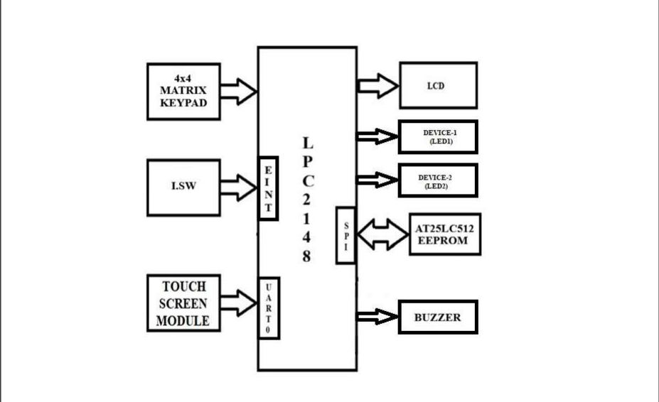

# TOUCH-BASED-DEVICE-CONTROL-SYSTEM-FOR-BEDRIDDEN-PATIENTS

## Overview

This project implements a Password-Protected Touch-Based Device Control System for Bedridden Patients using the LPC2148 ARM7 Microcontroller. The system enables physically challenged or bedridden individuals to control household devices through a resistive touch screen interface after successful password authentication. Passwords are securely stored in EEPROM and can be modified when required. The system also includes an emergency alert feature using a buzzer, providing additional safety and convenience.

---

## Block Diagram

